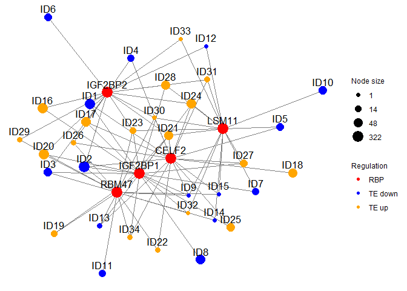

<!-- README.md is generated from README.Rmd. Please edit that file -->

# CLIPreg

<!-- badges: start -->

<!-- badges: end -->

The goal of CLIPreg is to discover key RBP regulators in different
datasets. It combines CLIP-seq with RNA- and RIBO-seq to calculate
enrichment of RBP and generate plots for publications. Another feature
that can be analyzed by CLIPreg is enrichment of miRNA targets from
TargetScan database.

## Installation

### Check and install required packages

Users may use following codes to check and install all the required
packages.

``` r
list.of.packages <- c("ggplot2","grid","doParallel","foreach","data.table","fastmatch","GGally","ggnet","topGO","ALL","devtools","org.Hs.eg.db","DESeq2")

## for package "ggplot2", "pheatmap", "grid", "doParallel", "foreach", "data.table", "fastmatch", "GGally"
new.packages <- list.of.packages[!(list.of.packages %in% installed.packages()[,"Package"])]
if(length(new.packages)) install.packages(new.packages)

## for package "topGO", "ALL", "ggnet", "ComplexHeatmap","org.Hs.eg.db", "DESeq2"
if (!requireNamespace("BiocManager", quietly = TRUE)) install.packages("BiocManager")
new.packages <- list.of.packages[!(list.of.packages %in% installed.packages()[,"Package"])]
if(length(new.packages))  BiocManager::install(new.packages)
if("ggnet"%in%new.packages)  devtools::install_github("briatte/ggnet")
devtools::install_version("network", version = "1.16.1", repos = "http://cran.us.r-project.org")
if("ComplexHeatmap"%in%new.packages)  devtools::install_github("jokergoo/ComplexHeatmap")
```

### Install CLIPreg

The source code of CLIPreg can be installed from
[GitHub](https://github.com/) with:

``` r
devtools::install_github("SGDDNB/CLIPreg")
```

CLIPreg requires 4 different inputs. A gene\_groups input which is a
dataframe containing geneID and the gene\_groups given by DeltaTE output
(ideally). The DeltaTE method can be found in the paper here:
<https://doi.org/10.1002/cpmb.108>. It categorizes transcriptionally
and/or translationally regulated genes into 4 categories: forwarded,
intensified, exclusive and buffered, each category with an up or down
direction. A deltaTE function is included in this package, it can be
found in advance usage step 0. The 3 other required files are :
summarized CLIP-seq data, with POSTAR and ENCODE which are pre-loaded in
the package, RIBO log fold change (lfc) and TPM.

``` r
## load libraries
library(CLIPreg)
library(ggplot2)
library(ComplexHeatmap)
library(grid)
library(doParallel)
library(ggnet)
library(topGO)
library(GGally)
library(data.table)
library(stringr)
library(DESeq2)
```

## Basic usage

For testing the package with the example data. This will load the
summary data of POSTAR and ENCODE as well as the TPM, lfc and
gene\_groups from the fibroblast dataset used in the paper.

``` r
Example=Load_example()
```

For using your own data, you must specify a folder that contains at
least 3 txt files that are named: gene\_groups.txt, ribo\_lfc.txt and
ribo\_tpm.txt. For the format of those 3 files, please refer to Advance
usage step 1.

``` r
Input_data=Load_input_files(folder = "path/to/folder")
```

Run the analysis with all default parameters.

``` r
results=run_CLIPreg(Example, is.example=T) # or run_CLIPreg(Input_data, is.example=F)
```

Generate the visual output from the results of the analysis. The
Visualise function will create 2 new files in the folder given: an Rdata
file containing the list object from the run\_CLIPreg function and a pdf
file with the main figures. The results are created with all default
parameters.

``` r
dir.create("Results_CLIPreg")
Visualise(results=results,folder="Results_CLIPreg")
```

## Advance usage

### Step 0 : Run deltaTE to find gene groups

This has to be done on the user’s dataset from raw counts of RIBO and
RNA as well as a coldata dataframe that can run through DESeq2. Put
batch = 1 if there is a batch column in the design. The counts must have
a first column containing the geneID or gene names, they must be unique.
The other columns are the raw counts of RNA and RIBO. The column names
for the counts must be the same names as filled in the “SampleID” column
of coldata. The coldata dataframe must have column names “SampleID”,
“SeqType”, “Condition” and “Batch”. (Batch is an optional column).
Condition must contain 1 and 2. For example, in an untreated vs
treatment drug experiment, set the untreated sample condition to 1 and
treatment to 2.

An example is provided in the github folder Example/Example\_deltaTE.R .
This function creates a folder in your current directory where it will
write the DESeq2 output for RNA and RIBO as well as the gene lists of
the different gene categories.

``` r
gene_groups=deltaTE_gene_groups(counts=counts,coldata=coldata,batch=0)
```

### Step 1: Input datasets

Let’s have a look at the gene\_groups file from the example data. It
consists in 2 columns containing the “geneID” and the “Gene\_group” for
all the DE genes. This is as an example on fibroblasts stimulated by
TGFB, when you start with your own gene groups, go to next code line.
Ideally, the gene groups are obtained from deltaTE analysis but any
method to find gene groups can also be run.

``` r
data("gene_groups")
head(gene_groups)
#>             geneID   Gene_group
#> 1:       LOC728392 forwarded_up
#> 2:      WRB-SH3BGR forwarded_up
#> 3: ENSG00000162408 forwarded_up
#> 4: ENSG00000204859 forwarded_up
#> 5: ENSG00000142583 forwarded_up
#> 6: ENSG00000116649 forwarded_up
```

To input your own gene groups, use the function load\_gene\_groups() and
give the file location of your gene group file as input. Each gene group
must contain “up” or “down” in the name or you won’t be able to plot the
network and gene ontology.

``` r
gene_groups=load_gene_groups(gene_groups_file = "path/to/gene_groups_file.txt")
```

Load POSTAR and ENCODE RBP data. Those are 2 public datasets which are
processed in order to have lists of vector. See “Pre-proessing” part of
this readme to find out more details. Each vector is named after 1 RBP
and contains the geneID of all the targets of that RBP. Combine both
data in a target list in the variable Targets. combine\_targets function
is a summary of both RBP data by filtering only targets which are
present in the background. This is to save time for the later analysis
in the clipreg function.

``` r
data("RBP_ENCODE")
data("RBP_POSTAR")
Targets=combine_targets(RBP_list1=RBP_ENCODE,RBP_list2=RBP_POSTAR,background=gene_groups$geneID)
Targets[c("POLR2G","PPIL4","SBDS")]
#> $POLR2G
#>  [1] "ENSG00000150527" "ENSG00000258941" "ENSG00000124782" "ENSG00000096063"
#>  [5] "ENSG00000152767" "ENSG00000078403" "ENSG00000105220" "ENSG00000178764"
#>  [9] "ENSG00000104419" "ENSG00000157933" "ENSG00000116285" "ENSG00000117394"
#> [13] "ENSG00000162337" "ENSG00000112715" "ENSG00000049618" "ENSG00000141526"
#> [17] "ENSG00000184640" "ENSG00000183255" "ENSG00000114268" "ENSG00000174485"
#> [21] "ENSG00000157985" "ENSG00000163811" "ENSG00000157827" "ENSG00000198648"
#> [25] "ENSG00000134318" "ENSG00000176171" "ENSG00000155034" "ENSG00000136478"
#> [29] "ENSG00000074047" "ENSG00000176853" "ENSG00000144366" "ENSG00000115295"
#> 
#> $PPIL4
#>  [1] "ENSG00000106415" "ENSG00000169122" "ENSG00000153317" "ENSG00000029534"
#>  [5] "ENSG00000197965" "ENSG00000151414" "ENSG00000185420" "ENSG00000014216"
#>  [9] "ENSG00000144674" "ENSG00000198431" "ENSG00000164117" "ENSG00000170242"
#> [13] "ENSG00000106034" "ENSG00000009954" "ENSG00000078304" "ENSG00000105220"
#> [17] "ENSG00000078674" "ENSG00000147454" "ENSG00000156467" "ENSG00000257315"
#> [21] "ENSG00000153187" "ENSG00000143401" "ENSG00000124942" "ENSG00000131747"
#> [25] "ENSG00000089280" "ENSG00000119231" "ENSG00000174485" "ENSG00000164104"
#> [29] "ENSG00000151466" "ENSG00000143797" "ENSG00000115310" "ENSG00000126883"
#> [33] "ENSG00000183087" "ENSG00000075407" "ENSG00000054277" "ENSG00000112531"
#> [37] "ENSG00000188994" "ENSG00000172432" "ENSG00000173926" "ENSG00000113013"
#> 
#> $SBDS
#> [1] "ENSG00000136574" "ENSG00000101558" "ENSG00000171310" "ENSG00000182326"
#> [5] "ENSG00000124486" "ENSG00000109971" "ENSG00000111678" "ENSG00000102265"
#> [9] "ENSG00000166224"
```

Load the fold change and identify the RBPs. If you have your own then
provide your own data. ribo\_lfc has 3 variables : “geneID”,
“IDENTIFIER” and “FoldChange”. ribo\_lfc only contains genes that
have been filtered to be significantly changing at the ribo level.
tpm\_ribo must have only counts as columns and geneID as rownames

``` r
# load fold change and tpm. optional if you want to use the input data
data("ribo_lfc")
data("tpm_ribo")

head(ribo_lfc)
#>                          geneID IDENTIFIER FoldChange
#> ENSG00000000003 ENSG00000000003     TSPAN6  0.3669041
#> ENSG00000000419 ENSG00000000419       DPM1  0.1026692
#> ENSG00000000457 ENSG00000000457      SCYL3 -0.4238081
#> ENSG00000000971 ENSG00000000971        CFH -0.2162611
#> ENSG00000001084 ENSG00000001084       GCLC -0.1003380
#> ENSG00000001461 ENSG00000001461     NIPAL3 -0.3866424
head(tpm_ribo[,1:4])
#>                 H24M00_24  H02M00_24   H00M45_24  H06M00_24
#> ENSG00000186092  0.000000  0.0000000  0.00000000  0.0000000
#> ENSG00000279928  0.000000  0.0000000  0.00000000  0.0000000
#> ENSG00000279457  0.000000  0.0000000  0.00000000  0.1574462
#> ENSG00000187634  0.161034  0.4122412  0.04622986  0.4131643
#> ENSG00000188976 19.156808 27.4931590 24.44454843 23.3971969
#> ENSG00000187961  2.228106  3.7949139  3.59028074  3.0119944
```

To load your own data use:

``` r
# If you want to input your own data
ribo_lfc=load_ribo_lfc(ribo_lfc_file = "ribo_lfc_file")
tpm_ribo=load_ribo_tpm(ribo_tpm_file = "ribo_tpm_file") # make sure rownames(tpm_ribo) corresponds to the geneID
```

### Step 2: Data integration and analysis

Run the enrichment analysis using CLIPreg() function. This takes several
minutes depending on how many gene groups and how many genes per gene
group there are. If you want to have a look at the example results skip
these 4 lines of code. For each RBP in each gene group, this function
computes the over representation of the RBP’s targets by calculating
z-score, p-value and padj (corresponding to FDR).

The output of CLIPreg() is a list of dataframes. One dataframe per gene
group containing the RBP and statistical information calculated during
the analysis such as p-value and z-score.

``` r
# The CLIPreg function requires a few minutes to run, save the data after running it to be sure not to lose it
res_Postar=CLIPreg(Regulator_data=RBP_POSTAR,gene_groups=gene_groups)
res_Encode=CLIPreg(Regulator_data=RBP_ENCODE,gene_groups=gene_groups)

save(res_Encode,file="Res_RBP_Encode.RData")
save(res_Postar,file="Res_RBP_Postar.RData")
```

If you want to get the results directly you can load it by using the
example data results. The result is a list of 8 dataframes, 8 being the
number of the gene groups found in this dataset. Each dataframe contains
a statistic summary of the enrichment of the targets of the RBP. The
CLIPreg function calculates the over-representation of RBP targets in
each of the gene groups. This is done by calculating the empirical
p-value of the frequency of interactions between any given RBP and each
individual DeltaTE group by comparing the number of observed
interactions with a null distribution generated from repeated shuffling
(n = 100,000 iterations) of the RBP-mRNA interactions. real\_overlap
corresponds to the actual overlap between the RBP targets and the gene
group while simulated\_overlap\_mean and sd correspond to the mean and
average of the null distribution.

``` r
data("res_Encode")
data("res_Postar")
head(res_Encode$exclusive_down)
#>       RBP real_overlap simulated_overlap_mean simulated_overlap_sd          z
#> 1 ZC3H11A           81               57.33332             6.529801  3.6244105
#> 2    GNL3            4                3.18980             1.719746  0.4711161
#> 3  HNRNPM           77               80.43285             7.323014 -0.4687756
#> 4   RBM15          112               96.60761             7.707256  1.9971297
#> 5   DDX24          121               82.58047             7.407222  5.1867666
#> 6   XRCC6           46               29.75390             4.971406  3.2679082
#>      pval         padj
#> 1 0.00023 5.850000e-04
#> 2 0.21196 2.952300e-01
#> 3 0.65267 7.814891e-01
#> 4 0.02041 3.411386e-02
#> 5 0.00001 3.078947e-05
#> 6 0.00061 1.486875e-03
```

Then we want to combine POSTAR and ENCODE to work with only one
dataframe and only keep RBPs that are significant in at least one gene
group. If an RBP is present in both POSTAR and ENCODE, only the most
significant result is kept.

``` r
res=CLIPreg::combine(res1=res_Encode,res2=res_Postar,FDR=0.05)
head(res[[1]])
#>        RBP real_overlap simulated_overlap_mean simulated_overlap_sd          z
#> 1   ALKBH1           40               40.97943             5.275220 -0.1856662
#> 2   ALKBH5          599              646.88781            15.573995 -3.0748572
#> 3    ATXN2         1231             1249.49058             9.418429 -1.9632341
#> 4 C17orf85          759              809.32365            15.414678 -3.2646579
#> 5  CAPRIN1          958             1014.84253            13.853814 -4.1030238
#> 6    CELF2          597              673.85913            15.640422 -4.9141339
#>      pval padj
#> 1 0.53155    1
#> 2 0.99897    1
#> 3 0.97092    1
#> 4 0.99938    1
#> 5 0.99997    1
#> 6 1.00000    1
```

Extract the RBP fold change from the ribo\_lfc and keep only detected
RBPs in res. If an RBP is not changing, it doesn’t make sense to look at
the enrichment of its targets so you should shortlist the RBP to only
keep the changing ones.

``` r
# Change of RBPs
rbp_lfc=rbp_change(res=res,ribo_lfc=ribo_lfc)
head(rbp_lfc)
#>                  geneID IDENTIFIER  FoldChange
#> FKBP4   ENSG00000004478      FKBP4 -0.14794320
#> AKAP8L  ENSG00000011243     AKAP8L -0.25094281
#> PTBP1   ENSG00000011304      PTBP1 -0.06274011
#> CELF2   ENSG00000048740      CELF2 -0.27227128
#> FAM120A ENSG00000048828    FAM120A  0.07316692
#> PUM2    ENSG00000055917       PUM2 -0.09197738
# Cure res data by removing RBPs that are not in the rbp_lfc dataframe
res=cure_res(res=res,regulators=rbp_lfc)
head(res[[1]])
#>       RBP real_overlap simulated_overlap_mean simulated_overlap_sd         z
#> 6   CELF2          597               673.8591             15.64042 -4.914134
#> 8   CPSF1          940              1000.8511             14.01741 -4.341108
#> 11  CPSF4          928               992.2613             14.13142 -4.547405
#> 15 CSTF2T         1173              1205.5442             10.55116 -3.084418
#> 22  EIF3D          621               653.3995             15.60483 -2.076250
#> 26  EWSR1          812               882.3352             15.01106 -4.685560
#>       pval padj
#> 6  1.00000    1
#> 8  0.99999    1
#> 11 1.00000    1
#> 15 0.99867    1
#> 22 0.97964    1
#> 26 1.00000    1
```

### Step 3: Visualisation

Generate and save heatmap to pdf. The heatmap represents the -logFDR of
each RBP for each gene group. The blue RBPs are downregulated and the
orange RBPs are upregulated. Only RBPs with targets that are
significantly enriched in at least one gene group are shown.

``` r
# Heatmap of RBP scores

HeatmapRBP(res=res,rbp_lfc=rbp_lfc)
```

<!-- -->

``` r

# If there is not at least 1 positive and 1 negative RBP lfc then use the heatmap for miRNA
# Heatmap_no_fold_change(res=res)
```

Suggestion for saving your heatmap

``` r
# Save the heatmap
p=HeatmapRBP(res=res,rbp_lfc=rbp_lfc)
location="Heatmap_fibroblasts.pdf"
n=length(p$tree_row$order)
pdf(location,length(names(res)),3+n*0.15)
p
dev.off()
```

A bubble plot can be generated to see the overall representation of the
RBPs’ targets. This can only be done if the gene groups are generated
from deltaTE\_gene\_groups function or with gene groups having similar
names to deltaTE groups.

``` r
# Bubble plot gene_groups if gene_groups are from DeltaTE. FDR has to be lower or equal to the FDR put in CLIPreg::combine() step
BubbleRBPs(res = res,gene_groups = gene_groups,rbp_lfc = rbp_lfc,FDR=0.05)
```

<!-- -->

From the results, the user can choose a number of RBP to draw the
network for by n. This will pick the n most changing RBPs based on fold
change for the network. In the case where the user wants to draw a
network with specific RBPs, he can input rpb\_lfc as a character vector
containing the RBP of interest

``` r
# Draw network of the RBP that are most changing or choose specific RBPs
Draw_network_by_group(regulators=rbp_lfc,res=res,Targets=Targets,gene_groups=gene_groups,n=5,forwarded = F)
```

<!-- -->

``` r

# You can subset your RBP_lfc to keep only your RBPs of interest. Make sure n = the number of RBP you want to plot.
# Draw_network_by_group(rbp_lfc=c("CELF2","HNRNPF","DDX24"),
#                        res=res,Targets=Targets,gene_groups=gene_groups,n=3,forwarded = F)
```

Gene ontology can be plotted for specific nodes or RBP. The P-value
corresponds to Fisher’s exact test p-value. This p-value is obtained
following the steps of the topGO vignette package. This p-value is not
corrected.

``` r
# plot GO, each plot takes a couple of minutes to generate.
Plot_GO(regulators=rbp_lfc,res=res,Targets=Targets,gene_groups=gene_groups,n=5,
  tpm_ribo = tpm_ribo,th=200,GO_to_show=3,forwarded = F)
```

<!-- -->

``` r
Plot_GO_node_name(regulators=rbp_lfc,res=res,Targets=Targets,gene_groups=gene_groups,n=5,
                  tpm_ribo = tpm_ribo,Nodes_to_keep=c(19,15),GO_to_show=3,forwarded = F)
```

<!-- -->

``` r
Plot_GO_RBP(rbp_of_interest="QKI",tpm_ribo = tpm_ribo,Targets=Targets,gene_groups=gene_groups,GO_to_show=3)
```

<!-- -->

## Analysis of miRNA target enrichment

The same analysis can be applied to run miRNA target enrichment. Here is
an example of the code that is very similar to the steps followed for
the RBPs.

``` r
data("miR_data") # preparation can be found below in section "Processing of miRNA file"
data("miR_info")
data("gene_groups") # for example on fibroblasts
Targets=GetTarget(Regulator_data=miR_data,background=gene_groups$geneID)
data("ribo_lfc")
data("tpm_ribo")
data("tpm_all_RNA")


# It's important to only keep miR which are detected transcriptionally
tpm_all_RNA=tpm_all_RNA[rowSums(tpm_all_RNA > 1) >= 1, ]
miR_info=miR_info[miR_info$ensembl_gene_id%in%rownames(tpm_all_RNA),]
miR_data=subset(miR_data,names(miR_data)%in%miR_info$mirbase_id)
```

You can then run the CLIPreg function to the data to get the enrichment
details in each gene group.

``` r
#This is done on the example set, you can skip to next code for the results
res_miR=CLIPreg(Regulator_data=miR_data,gene_groups=gene_groups) # Takes several minutes
save(res_miR,file="Res_miR.RData")
```

The output format is the same as for CLIPreg run on RBPs

``` r
data("Res_miR")
res=CLIPreg::combine(res1=res_miR,res2 = res_miR,FDR=0.05)
head(res[[1]])
#>            RBP real_overlap simulated_overlap_mean simulated_overlap_sd
#> 1   hsa-let-7a           76               97.68733             7.993385
#> 2   hsa-let-7d           78              100.35444             8.093840
#> 3   hsa-let-7f           76               97.68730             7.993864
#> 4   hsa-let-7i           76               97.68787             7.992613
#> 6 hsa-mir-103a           56               73.65762             6.999898
#> 7 hsa-mir-106b           84              107.46823             8.360617
#>           z    pval    padj
#> 1 -2.713160 0.99660 0.99999
#> 2 -2.761908 0.99712 0.99999
#> 3 -2.712993 0.99667 0.99999
#> 4 -2.713489 0.99663 0.99999
#> 6 -2.522554 0.99390 0.99999
#> 7 -2.806998 0.99745 0.99999
```

A heatmap can be plotted also for miRNA

``` r
Heatmap_no_fold_change(res=res)
```

<!-- -->

``` r


# Suggestion to save the heatmap 
# e=Heatmap_no_fold_change(res=res)
# location="Heatmap_HeLa_EGF_miRNA.pdf"
# n=nrow(e@matrix)
# pdf(location,length(names(res))+3,3+n*0.15)
# e
# dev.off()
```

We found that miRNAs targets were enriched in the forwarded down and
buffered up groups as shown in this heatmap. These were both groups
where the RNA levels are downregulated which aligns with the known
function of miRNAs to silence or downregulate RNA transcription.
Moreover we also found some miRNAs that have been known to be important
in fibroblast activation such as miR-199a-5p which is known to promote
pathogenic activation of fibroblast by regulating CAV1 gene (Lino
Cardenas et al., 2013). We not only found CAV1 as a target of
miR-199a-5p in the forwarded down group but also 100s/1000s of other
targets that could potentially be playing a role in this miRNA’s
regulatory network towards fibroblast activation.

Network and GO plots are also available for miRNA

``` r
# Network and GO
# As we don't have fold change for miRNA, you can input miR names in the regulators for the plots.
Draw_network_by_group(regulators=c("hsa-mir-301a","hsa-mir-454","hsa-mir-544a","hsa-mir-106b","hsa-mir-148b"),res=res,Targets=Targets,gene_groups=gene_groups,n=5,forwarded = T)
#> Scale for 'size' is already present. Adding another scale for 'size', which
#> will replace the existing scale.
#> Scale for 'colour' is already present. Adding another scale for 'colour',
#> which will replace the existing scale.
```

<!-- -->

``` r
Plot_GO_RBP(rbp_of_interest="hsa-mir-301a",tpm_ribo = tpm_ribo,Targets=Targets,gene_groups=gene_groups,GO_to_show=3)
#> 
#> Building most specific GOs .....
#>  ( 12282 GO terms found. )
#> 
#> Build GO DAG topology ..........
#>  ( 15893 GO terms and 36213 relations. )
#> 
#> Annotating nodes ...............
#>  ( 16889 genes annotated to the GO terms. )
#> 
#>           -- Classic Algorithm -- 
#> 
#>       the algorithm is scoring 1097 nontrivial nodes
#>       parameters: 
#>           test statistic: fisher
#> 
#> Building most specific GOs .....
#>  ( 12282 GO terms found. )
#> 
#> Build GO DAG topology ..........
#>  ( 15893 GO terms and 36213 relations. )
#> 
#> Annotating nodes ...............
#>  ( 16889 genes annotated to the GO terms. )
#> 
#>           -- Classic Algorithm -- 
#> 
#>       the algorithm is scoring 2735 nontrivial nodes
#>       parameters: 
#>           test statistic: fisher
```

<!-- -->

## Example 2: CLIPreg without using deltaTE

HeLa stimulated by EGF. Groups were obtained by categorizing into TE\_up
and TE\_down from data given in the paper
<https://pubmed.ncbi.nlm.nih.gov/30466063/>. Data preparation can be
found in the “Pre-Processing” part of the readme.

First loading the required tables.

``` r
# RBP analysis
data("gene_groups_HeLa_EGF")
data("ribo_lfc_HeLa_EGF")
data("tpm_ribo_HeLa_EGF.RData")
data("RBP_ENCODE")
data("RBP_POSTAR")
Targets_HeLa=combine_targets(RBP_list1=RBP_ENCODE,RBP_list2=RBP_POSTAR,background=gene_groups$geneID)
```

Run RBP target enrichment.

``` r
res_Postar_HeLa=CLIPreg(Regulator_data=RBP_POSTAR,gene_groups=gene_groups)
res_Encode_HeLa=CLIPreg(Regulator_data=RBP_ENCODE,gene_groups=gene_groups)

save(res_Encode_HeLa,file="Res_Encode_HeLa.RData")
save(res_Postar_HeLa,file="Res_Postar_HeLa.RData")
```

``` r
data("Res_Encode_HeLa")
data("Res_Postar_HeLa")
res_HeLa=CLIPreg::combine(res1=res_Encode_HeLa,res2=res_Postar_HeLa,FDR=0.05)

rbp_lfc=rbp_change(res=res_HeLa,ribo_lfc=ribo_lfc) # None of the RBP are changing
res_HeLa=cure_res(res=res_HeLa,regulators=rbp_lfc)
rbp_lfc
#>                  geneID IDENTIFIER  FoldChange
#> FKBP4   ENSG00000004478      FKBP4 -0.14794320
#> AKAP8L  ENSG00000011243     AKAP8L -0.25094281
#> FAM120A ENSG00000048828    FAM120A  0.07316692
#> YBX3    ENSG00000060138       YBX3  0.04605895
#> DDX24   ENSG00000089737      DDX24 -0.02952209
#> TIA1    ENSG00000116001       TIA1 -0.17198740
#> GTF2F1  ENSG00000125651     GTF2F1  0.05483682
#> ILF3    ENSG00000129351       ILF3 -0.06083720
#> PPIL4   ENSG00000131013      PPIL4  0.19073440
#> ZRANB2  ENSG00000132485     ZRANB2  0.18935468
#> TBRG4   ENSG00000136270      TBRG4 -0.18033802
#> SLTM    ENSG00000137776       SLTM -0.11829053
#> LSM11   ENSG00000155858      LSM11  0.26538760
#> SUPV3L1 ENSG00000156502    SUPV3L1  0.06192888
#> LARP4   ENSG00000161813      LARP4 -0.15813233
#> CSTF2T  ENSG00000177613     CSTF2T  0.17996868
#> EWSR1   ENSG00000182944      EWSR1  0.04042333
#> PCBP2   ENSG00000197111      PCBP2 -0.06077447
```

As we can see, none of the RBP are changing. If you still want to plot
the heatmap although no RBP are found changing, you can use the
Heatmap\_no\_fold\_change function which doesn’t require regulators.

``` r
Heatmap_no_fold_change(res=res_HeLa) # The RBP are not changing --> need to use the miRNA heatmap
```

<!-- -->

Not enough RBP are significant with enough targets to give any meaning
to the network and gene ontology plot

``` r
# Draw_network_by_group(regulators=c("GRWD1","GRSF1","SUGP2","DHX30","LSM11"),res=res,Targets=Targets_HeLa,gene_groups=gene_groups,n=5,forwarded = F)
# Plot_GO_RBP(rbp_of_interest="GRWD1",tpm_ribo = tpm_ribo,Targets=Targets_HeLa,gene_groups=gene_groups,GO_to_show=3)
```

miRNA analysis can also be applied to this data. Look at “Analysis of
miRNA target enrichment” in this readme for more details about how miR
enrichment steps work.

``` r
# miRNA analysis
data("gene_groups_HeLa_EGF")
data("ribo_lfc_HeLa_EGF")
data("tpm_ribo_HeLa_EGF.RData")
data("tpm_all_RNA_HeLa_EGF")
data("miR_data")
data("miR_info")


tpm_all_RNA=tpm_all_RNA[rowSums(tpm_all_RNA > 1) >= 1, ]
miR_info=miR_info[miR_info$ensembl_gene_id%in%rownames(tpm_all_RNA),]
miR_data=subset(miR_data,names(miR_data)%in%miR_info$mirbase_id)

res_miR=CLIPreg(Regulator_data=miR_data,gene_groups=gene_groups)
save(res_miR,file="Res_miR_HeLa_EGF.RData")
res=CLIPreg::combine(res1=res_miR,res2=res_miR,FDR=0.05)

Heatmap_no_fold_change(res=res) # need to use the Heatmap_no_fold_change
Targets=GetTarget(Regulator_data=miR_data,background=gene_groups$geneID)
Draw_network_by_group(regulators=c("hsa-mir-652","hsa-mir-499a","hsa-mir-99b","hsa-mir-875","hsa-mir-501"),res=res,Targets=Targets,gene_groups=gene_groups,n=5,forwarded = F)
Plot_GO_RBP(rbp_of_interest="hsa-mir-501",tpm_ribo=tpm_ribo,Targets=Targets,gene_groups=gene_groups,
            GO_to_show=3)
```

## Pre-processing

### CLIP data preparation

``` r


# Processing of CLIPseq summary files

data("Example_bed")
Example_bed
#>   chrom chromStart  chromEnd                                       name score
#> 1 chr10  100000152 100000166  human_RBP_CLIPdb_PAR-CLIP_PARalyzer194179     0
#> 2 chr10  100000152 100000166  human_RBP_CLIPdb_PAR-CLIP_PARalyzer628883     0
#> 3 chr10  100000152 100000167 human_RBP_CLIPdb_PAR-CLIP_PARalyzer5906935     0
#> 4 chr10  100000152 100000167 human_RBP_CLIPdb_PAR-CLIP_PARalyzer6193374     0
#> 5 chr10  100000156 100000168 human_RBP_CLIPdb_PAR-CLIP_PARalyzer2957449     0
#> 6 chr10  100000156 100000168 human_RBP_CLIPdb_PAR-CLIP_PARalyzer3234693     0
#>   strand thickStart           thickEnd itemRgb          blockCount blockSizes
#> 1      +     HNRNPC PAR-CLIP,PARalyzer HEK293T GSE56010,GSM1350196  0.7479220
#> 2      +     HNRNPC PAR-CLIP,PARalyzer HEK293T GSE56010,GSM1350196  0.7479220
#> 3      +     HNRNPC PAR-CLIP,PARalyzer HEK293T GSE56010,GSM1350200  0.5935826
#> 4      +     HNRNPC PAR-CLIP,PARalyzer HEK293T GSE56010,GSM1350200  0.5935826
#> 5      +     HNRNPC PAR-CLIP,PARalyzer HEK293T GSE56010,GSM1350198  0.6989123
#> 6      +     HNRNPC PAR-CLIP,PARalyzer HEK293T GSE56010,GSM1350198  0.6989123

# Step 1 : Download all RBP clip-seq bed files from encode and combine them into 1 be
# Step 2 : Filter to keep high score peaks only. >8fold enrichment and P value <10e-5
# Step 3 : Intersect bed file with Ensembl genes gtf file to find target genes
# Step 4 : Shortlist columns to keep RBP and targets

# For Postar data, download from POSTAR3 website CLIPdb
# Start from step3 of ENCODE

# The RBP_data format, obtained after processing the bed file, needs to be a list of RBPs with each RBP containing a vector of target geneIDs. For Example :
data("RBP_ENCODE")
RBP_ENCODE[c("POLR2G","PPIL4","SBDS")]
#> $POLR2G
#>  [1] "ENSG00000150527" "ENSG00000258941" "ENSG00000124782" "ENSG00000096063"
#>  [5] "ENSG00000152767" "ENSG00000078403" "ENSG00000105220" "ENSG00000178764"
#>  [9] "ENSG00000104419" "ENSG00000157933" "ENSG00000116285" "ENSG00000117394"
#> [13] "ENSG00000162337" "ENSG00000112715" "ENSG00000049618" "ENSG00000141526"
#> [17] "ENSG00000184640" "ENSG00000183255" "ENSG00000114268" "ENSG00000174485"
#> [21] "ENSG00000157985" "ENSG00000163811" "ENSG00000157827" "ENSG00000198648"
#> [25] "ENSG00000134318" "ENSG00000176171" "ENSG00000155034" "ENSG00000136478"
#> [29] "ENSG00000074047" "ENSG00000176853" "ENSG00000144366" "ENSG00000115295"
#> 
#> $PPIL4
#>  [1] "ENSG00000106415" "ENSG00000169122" "ENSG00000153317" "ENSG00000029534"
#>  [5] "ENSG00000197965" "ENSG00000151414" "ENSG00000185420" "ENSG00000014216"
#>  [9] "ENSG00000144674" "ENSG00000198431" "ENSG00000164117" "ENSG00000170242"
#> [13] "ENSG00000106034" "ENSG00000009954" "ENSG00000078304" "ENSG00000105220"
#> [17] "ENSG00000078674" "ENSG00000147454" "ENSG00000156467" "ENSG00000257315"
#> [21] "ENSG00000153187" "ENSG00000143401" "ENSG00000124942" "ENSG00000131747"
#> [25] "ENSG00000089280" "ENSG00000119231" "ENSG00000174485" "ENSG00000164104"
#> [29] "ENSG00000151466" "ENSG00000143797" "ENSG00000115310" "ENSG00000126883"
#> [33] "ENSG00000183087" "ENSG00000075407" "ENSG00000054277" "ENSG00000112531"
#> [37] "ENSG00000188994" "ENSG00000172432" "ENSG00000173926" "ENSG00000113013"
#> 
#> $SBDS
#> [1] "ENSG00000136574" "ENSG00000101558" "ENSG00000171310" "ENSG00000182326"
#> [5] "ENSG00000124486" "ENSG00000109971" "ENSG00000111678" "ENSG00000102265"
#> [9] "ENSG00000166224"
```

### Processing of miRNA file

``` r
# Processing of miRNA file
BiocManager::install("miRBaseConverter")
BiocManager::install("biomaRt")
library(biomaRt)
library(data.table)
library(miRBaseConverter)
library(stringr)

# miR file was downloaded from TargetScan context++
miR=fread("~/Downloads/Predicted_Targets_Context_Scores.default_predictions.txt/Predicted_Targets_Context_Scores.default_predictions.txt")

# simplifying names to make sure target scan names are the same as mirBase names for all miRNAs
index=str_sub(miR$miRNA,-1,-1)=="p"
miR$miRNA[index]=gsub('.{3}$', '',miR$miRNA[index] )

miRBase=getAllMiRNAs()
mart <- useDataset("hsapiens_gene_ensembl", useMart("ensembl"))
G_list <- getBM(filters= "mirbase_id", attributes= c("ensembl_gene_id","mirbase_id"),values=miRBase$Name,mart= mart)

index=str_sub(G_list$mirbase_id,-1,-1)=="p"
G_list$mirbase_id[index]=gsub('.{3}$', '',G_list$mirbase_id[index] )
index=str_sub(G_list$mirbase_id,-2,-2)=="-"
G_list$mirbase_id[index]=gsub('.{2}$', '',G_list$mirbase_id[index] )

index=str_sub(miRBase$Name,-1,-1)=="p"
miRBase$Name[index]=gsub('.{3}$', '',miRBase$Name[index] )
index=str_sub(miRBase$Name,-2,-2)=="-"
miRBase$Name[index]=gsub('.{2}$', '',miRBase$Name[index] )

# Keeping only targets which have a weighted context score below -0.1
Thres=-0.1
miR=miR[tolower(miR$miRNA)%in%tolower(miRBase$Name),]
miR=miR[miR$`weighted context++ score`<Thres,]
miR_names=unique(miR$miRNA)

# Saving in a format readable for CLIPreg
miR_data=list()
for (i in miR_names) {
  miR_i=miR[miR$miRNA==i,]
  miR_data[[i]]=unique(miR_i$`Gene ID`)
  miR_data[[i]]=gsub("\\..*","",miR_data[[i]])
}
miR_data=miR_data[sort(names(miR_data))]
miR_data=subset(miR_data,tolower(names(miR_data))%in%tolower(G_list$mirbase_id))
names(miR_data)=tolower(names(miR_data))

save(miR_data,file = "data/miR_data.RData")

G_list=G_list[G_list$mirbase_id%in%c(miR_names,tolower(miR_names)),]
colnames(G_list)=c("geneID","miRBase_ID")
miR_info=G_list

miR_info$mirbase_id=tolower(miR_info$mirbase_id)
save(miR_info,file = "data/miR_info.RData")
```

### Example 2: Data pre-processing without using deltaTE

The csv files used for pre-processing can be found in the “Example”
folder of CLIPreg’s github page.

``` r
BiocManager::install("biomaRt")
library(biomaRt)

# Get gene groups from existing data

file="HeLa_EGF_TE.csv"
df=read.csv(file)
sig_30=df$IDENTIFIER[df$pval_TE_30<0.05]
sig_60=df$IDENTIFIER[df$pval_TE_60<0.05]
sig_90=df$IDENTIFIER[df$pval_TE_90<0.05]

TE_genes=unique(c(sig_30,sig_60,sig_90))

df=df[df$IDENTIFIER%in%TE_genes,]
df=df[!duplicated(df$IDENTIFIER),]

gene_groups=data.frame(IDENTIFIER=df$IDENTIFIER,Gene_group=0)

for (i in 1:nrow(df)) {
  ID=df$IDENTIFIER[i]
  lowest_pval=which(df[i,4:6]==min(df[i,4:6]))
  TE_sign=sign(df[i,lowest_pval+1])
  if (TE_sign>0) {gene_groups$Gene_group[i]="TE_up"} else {gene_groups$Gene_group[i]="TE_down"}
}

# Associate geneID and IDENTIFIER
library('biomaRt')
mart <- useDataset("hsapiens_gene_ensembl", useMart("ensembl"))
genes <- df$IDENTIFIER
G_list <- getBM(filters= "hgnc_symbol", attributes= c("ensembl_gene_id","hgnc_symbol"),values=genes,mart= mart)
head(G_list)

colnames(G_list)=c("geneID","IDENTIFIER")

gene_groups=merge(G_list,gene_groups,by.y="IDENTIFIER")
save(gene_groups,file="data/gene_groups_HeLa_EGF.RData")

# prepare ribo_lfc data

file="HeLa_EGF_ribo_lfc.csv"
df=read.csv(file)
df[which(is.na(df),arr.ind = T)]=1

geneNames=unique(df$IDENTIFIER)
ribo_lfc=data.frame(IDENTIFIER=geneNames,FoldChange=0)

for (i in 1:nrow(df)) {
  lowest_pval=min(df[i,6:8])
  if (lowest_pval<0.05) {
    lowest_pval_index=which(df[i,6:8]==min(df[i,6:8]))[1]
    ribo_lfc[ribo_lfc$IDENTIFIER==df$IDENTIFIER[i],"FoldChange"]=df[i,lowest_pval_index+2]
  }
}


library('biomaRt')
mart <- useDataset("hsapiens_gene_ensembl", useMart("ensembl"))
genes <- ribo_lfc$IDENTIFIER
G_list <- getBM(filters= "hgnc_symbol", attributes= c("ensembl_gene_id","hgnc_symbol"),values=genes,mart= mart)
head(G_list)

colnames(G_list)=c("geneID","IDENTIFIER")
ribo_lfc=merge(G_list,ribo_lfc,by.y="IDENTIFIER")
ribo_lfc=ribo_lfc[!duplicated(ribo_lfc$IDENTIFIER),]
rownames(ribo_lfc)=ribo_lfc$IDENTIFIER
save(ribo_lfc,file="data/ribo_lfc_HeLa_EGF.RData")


# TPM must be shortlistede to keep expressed genes only
file="HeLa_EGF_Ribo_TPM.csv"
df=read.csv(file)

df=df[rowSums(df[,2:7] > 1) >= 1,]
df=df[!duplicated(df$IDENTIFIER),]

library('biomaRt')
mart <- useDataset("hsapiens_gene_ensembl", useMart("ensembl"))
genes <- df$IDENTIFIER
G_list <- getBM(filters= "hgnc_symbol", attributes= c("ensembl_gene_id","hgnc_symbol"),values=genes,mart= mart)
head(G_list)

colnames(G_list)=c("geneID","IDENTIFIER")
tpm_ribo=merge(G_list,df,by.y="IDENTIFIER")
tpm_ribo=tpm_ribo[!duplicated(tpm_ribo$IDENTIFIER),]
rownames(tpm_ribo)=tpm_ribo$IDENTIFIER
save(tpm_ribo,file="data/tpm_ribo_HeLa_EGF.RData")
```
