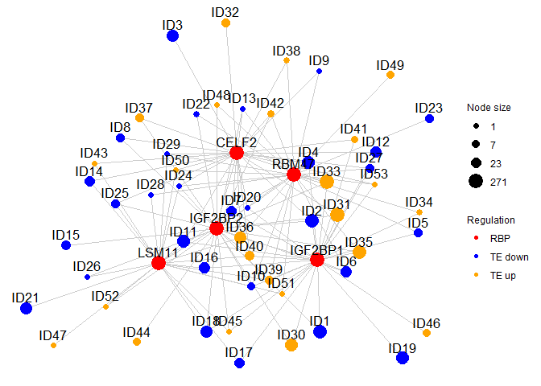

<!-- README.md is generated from README.Rmd. Please edit that file -->

# CLIPreg

<!-- badges: start -->

<!-- badges: end -->

The goal of CLIPreg is to discover key RBP regulators in different
datasets. It combines CLIP-seq with RNA- and RIBO-seq to calculate
enrichment of RBP and generate plots for publications.

## Installation

### Check and install required packages

Users may use following codes to check and install all the required
packages.

``` r
list.of.packages <- c("ggplot2","pheatmap","grid","doParallel","foreach","data.table","fastmatch","GGally","ggnet","topGO","ALL","devtools")

## for package "ggplot2", "pheatmap", "grid", "doParallel", "foreach", "data.table", "fastmatch", "GGally"
new.packages <- list.of.packages[!(list.of.packages %in% installed.packages()[,"Package"])]
if(length(new.packages)) install.packages(new.packages)

## for package "topGO", "ALL"
if (!requireNamespace("BiocManager", quietly = TRUE)) install.packages("BiocManager")
new.packages <- list.of.packages[!(list.of.packages %in% installed.packages()[,"Package"])]
if(length(new.packages))  BiocManager::install(new.packages)
if("ggnet"%in%new.packages)  devtools::install_github("briatte/ggnet")
```

### Install CLIPreg

The source code of CLIPreg can be installed from
[GitHub](https://github.com/) with:

``` r
devtools::install_github("SGDDNB/CLIPreg")
```

## Input datasets

CLIPreg requires 4 different inputs. A cluster input which is a
dataframe containing geneID and the cluster given by DeltaTE output.
Curated CLIP-seq data that can be downloaded from . RIBO and RNA lfc and
TPM. (TPM are optional)

``` r
## load libraries
library(CLIPreg)
library(ggplot2)
library(pheatmap)
#> Warning: package 'pheatmap' was built under R version 3.6.3
library(grid)
library(doParallel)
#> Warning: package 'doParallel' was built under R version 3.6.3
#> Warning: package 'foreach' was built under R version 3.6.3
#> Warning: package 'iterators' was built under R version 3.6.3
library(ggnet)
library(topGO)
#> Warning: package 'S4Vectors' was built under R version 3.6.3
#> Warning: package 'SparseM' was built under R version 3.6.3
library(data.table)
#> Warning: package 'data.table' was built under R version 3.6.3
library(stringr)
#> Warning: package 'stringr' was built under R version 3.6.3
```

Let’s have a look at the cluster file from the example data. It consists
of 2 columns containing the geneID and the cluster for all the DE genes.
This is optional, if you want to provide your own clusters, go to next
step.

``` r
data("clusters")
head(clusters)
#>             geneID      Cluster
#> 1:       LOC728392 forwarded_up
#> 2:      WRB-SH3BGR forwarded_up
#> 3: ENSG00000162408 forwarded_up
#> 4: ENSG00000204859 forwarded_up
#> 5: ENSG00000142583 forwarded_up
#> 6: ENSG00000116649 forwarded_up
```

You can input your own clusters by using the function load\_clusters()
and giving the file location of your file as input.

``` r
#clusters=load_clusters(cluster_file = "cluster_file")
```

Load POSTAR and ENCODE RBP data. Those are 2 public datasets which are
processed in order to have lists of vector. Each vector is named after 1
RBP and contains the geneID of all the targets of that RBP. Combine both
data in a target list.

``` r
data("RBP_ENCODE")
data("RBP_POSTAR")
Targets=combine_targets(RBP_list1=RBP_ENCODE,RBP_list2=RBP_POSTAR,background=clusters$geneID)
```

Run the enrichment analysis using CLIPReg\_V4() function. This takes
several minutes. If you want to have a look at the example results skip
this step.

``` r
# The CLIPreg_V4 function requires a few minutes to run, save the data after running it to be sure not to lose it
# res_Postar=CLIPReg_V4(RBP_data=RBP_POSTAR,clusters=clusters)
# res_Encode=CLIPReg_V4(RBP_data=RBP_ENCODE,clusters=clusters)
# save(res_Encode,file="Res_RBP_Encode.RData")
# save(res_Postar,file="Res_RBP_Postar.RData")
```

If you want to get the results directly you can load it by using the
example data results. The output of CLIPReg\_V4() is a list of
dataframes. One dataframe per cluster containing the RBP and statistical
information calculated during the analysis such as p-value and z-score.

``` r
data("Res_Encode")
data("Res_Postar")
head(res_Encode[[1]])
#>       RBP real_overlap simulated_overlap_mean simulated_overlap_sd          z
#> 1 ZC3H11A          268              282.41101            12.590167 -1.1446242
#> 2    GNL3           14               15.73466             3.306621 -0.5246020
#> 3  HNRNPM          345              396.49065            14.077142 -3.6577488
#> 4   RBM15          461              476.04563            14.839723 -1.0138754
#> 5   DDX24          370              406.79695            14.246241 -2.5829235
#> 6   XRCC6          142              146.71529             9.573704 -0.4925252
#>      pval
#> 1 0.86594
#> 2 0.63920
#> 3 0.99986
#> 4 0.83574
#> 5 0.99474
#> 6 0.66889
```

Then we want to combine POSTAR and ENCODE to work with only one
dataframe and only keep RBPs that are significant in at least one
cluster.

``` r

res=CLIPreg::combine(res1=res_Encode,res2=res_Postar)
```

Load the fold change and identify the RBPs. If you have your own then
provide your own data.

``` r
# load fold change and tpm. optional if you want to use the input data
data("ribo_lfc")
data("tpm_ribo")

head(ribo_lfc)
#>                          geneID IDENTIFIER  FoldChange
#> ENSG00000000003 ENSG00000000003     TSPAN6  0.36690410
#> ENSG00000000419 ENSG00000000419       DPM1  0.10266923
#> ENSG00000000457 ENSG00000000457      SCYL3 -0.42380808
#> ENSG00000000971 ENSG00000000971        CFH -0.21626115
#> ENSG00000001036 ENSG00000001036      FUCA2 -0.04897555
#> ENSG00000001084 ENSG00000001084       GCLC -0.10033803
head(tpm_ribo)
#>                 H24M00_24  H02M00_24   H00M45_24  H06M00_24   H00M00_24
#> ENSG00000186092  0.000000  0.0000000  0.00000000  0.0000000  0.00000000
#> ENSG00000279928  0.000000  0.0000000  0.00000000  0.0000000  0.00000000
#> ENSG00000279457  0.000000  0.0000000  0.00000000  0.1574462  0.12958297
#> ENSG00000187634  0.161034  0.4122412  0.04622986  0.4131643  0.03778295
#> ENSG00000188976 19.156808 27.4931590 24.44454843 23.3971969 28.27607688
#> ENSG00000187961  2.228106  3.7949139  3.59028074  3.0119944  3.08605436
#>                  H24M00_27  H02M00_27 H00M45_27 H06M00_27 H00M00_27   H24M00_34
#> ENSG00000186092  0.0000000  0.0000000  0.000000   0.00000  0.000000  0.00000000
#> ENSG00000279928  0.0000000  0.0000000  0.000000   0.00000  0.000000  0.00000000
#> ENSG00000279457  0.0000000  0.0000000  0.000000   0.00000  0.000000  0.04557422
#> ENSG00000187634  0.2139946  0.1403437  0.000000   0.00000  0.000000  0.29234109
#> ENSG00000188976 17.9646925 25.4619899 17.555354  24.98123 24.051300 20.17483529
#> ENSG00000187961  1.8147343  3.0442891  2.188211   4.21726  2.331706  2.49099609
#>                  H02M00_34 H00M45_34  H06M00_34  H00M00_34  H24M00_41
#> ENSG00000186092  0.0000000  0.000000  0.0000000  0.0000000  0.0000000
#> ENSG00000279928  0.0000000  0.000000  0.0000000  0.0000000  0.0000000
#> ENSG00000279457  0.0000000  0.000000  0.0000000  0.3603817  0.0000000
#> ENSG00000187634  0.1226459  0.000000  0.4060926  0.0000000  0.2032884
#> ENSG00000188976 20.4944669 22.201090 29.0017360 17.6842060 21.8864274
#> ENSG00000187961  2.6686037  2.663512  2.7640857  1.9697750  3.5386191
#>                  H02M00_41   H00M45_41  H06M00_41   H00M00_41      H24M00
#> ENSG00000186092  0.0000000  0.00000000  0.0000000  0.00000000  0.00000000
#> ENSG00000279928  0.0000000  0.00000000  0.0000000  0.00000000  0.00000000
#> ENSG00000279457  0.0000000  0.06978676  0.1082100  0.00000000  0.01139355
#> ENSG00000187634  0.1230734  0.00000000  0.1262047  0.05208434  0.21766453
#> ENSG00000188976 25.6780119 20.54693635 25.9848515 30.64854208 19.79569089
#> ENSG00000187961  2.9662968  2.34313487  3.4642332  2.37117682  2.51811379
#>                     H02M00      H00M45      H06M00      H00M00          geneID
#> ENSG00000186092  0.0000000  0.00000000  0.00000000  0.00000000 ENSG00000186092
#> ENSG00000279928  0.0000000  0.00000000  0.00000000  0.00000000 ENSG00000279928
#> ENSG00000279457  0.0000000  0.01744669  0.06641406  0.12249118 ENSG00000279457
#> ENSG00000187634  0.1995761  0.01155747  0.23636539  0.02246682 ENSG00000187634
#> ENSG00000188976 24.7819069 21.18698223 25.84125350 25.16503133 ENSG00000188976
#> ENSG00000187961  3.1185259  2.69628465  3.36439341  2.43967792 ENSG00000187961
#>                 IDENTIFIER
#> ENSG00000186092      OR4F5
#> ENSG00000279928 FO538757.1
#> ENSG00000279457     WASH9P
#> ENSG00000187634     SAMD11
#> ENSG00000188976      NOC2L
#> ENSG00000187961     KLHL17

# If you want to input your own data
#load_ribo_lfc(ribo_lfc_file = "ribo_lfc_file")
#load_ribo_tpm(ribo_tpm_file = "ribo_tpm_file")
```

Extract the RBP LFC from the RIBO\_LFC and keep only detected RBPs in
res

``` r
# Change of RBPs
rbp_lfc=rbp_change(res=res,ribo_lfc=ribo_lfc)

# Cure res data by removing RBPs that are not in the rbp_lfc dataframe
res=cure_res(res=res,rbp_lfc=rbp_lfc)
```

Generate and save heatmap to pdf. The heatmap represents the -logP of
each RBP for each cluster. The blue RBPs are downregulated and the
orange RBPs are upregulated. Only RBPs that are significant in at least
one cluster are shown.

``` r
# Heatmap of RBP scores

e=HeatmapRBP(res=res,rbp_lfc=rbp_lfc,grid=F)
e # Plot the heatmap with updated colors for the RBPs
```

<!-- -->

``` r

# Save the heatmap
# location="Heatmap_fibroblasts.pdf"
# n=length(e$tree_row$order)
# pdf(location,8,3+n*0.15)
# e
# dev.off()
```

A bubble plot can be generated only if the clusters are the output of
DeltaTE program.

``` r
# Bubble plot clusters if clusters are from DeltaTE
BubbleRBPs(RBP_res = res,clusters = clusters)
```

<!-- -->

From the results, the user can choose a number of RBP to draw the
network for by n. This will pick the n most changing RBPs.

``` r
# Draw network
Draw_network_by_group(rbp_lfc=rbp_lfc,res=res[-c(1,2)],Targets=Targets,clusters=clusters,n=5)
```

<!-- -->

``` r
# plot GO
Plot_GO(rbp_lfc=rbp_lfc,res=res[-c(1,2)],Targets=Targets,clusters=clusters,n=5,
  tpm_ribo = tpm_ribo,th=200,GO_to_show=3)
```

<!-- -->

``` r
Plot_GO_node_name(rbp_lfc=rbp_lfc,res=res[-c(1,2)],Targets=Targets,clusters=clusters,n=5,
                  tpm_ribo = tpm_ribo,Nodes_to_keep=c(19,15),GO_to_show=3)
```

<!-- -->

``` r
Plot_GO_RBP(rbp_of_interest="QKI",tpm_ribo = tpm_ribo,Targets=Targets,clusters=clusters,GO_to_show=3)
```

<!-- -->
